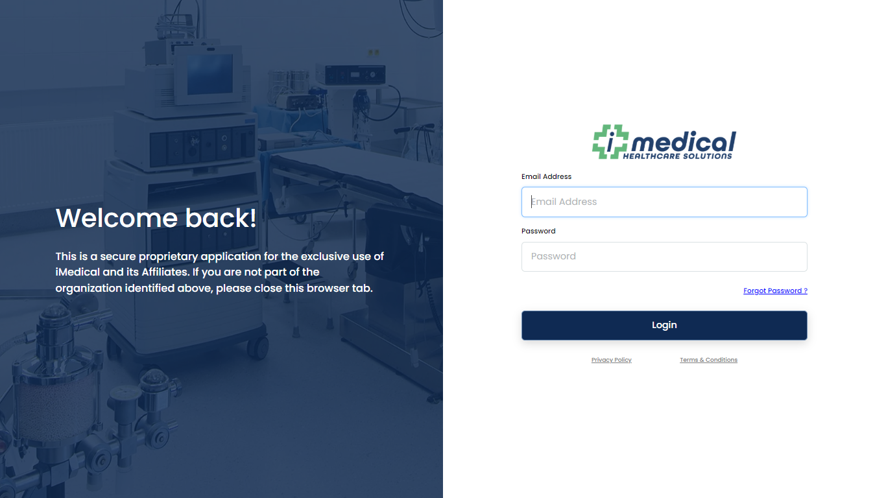
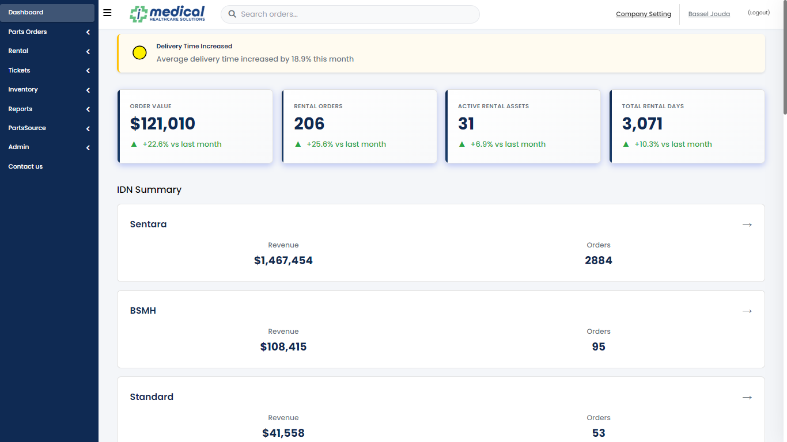
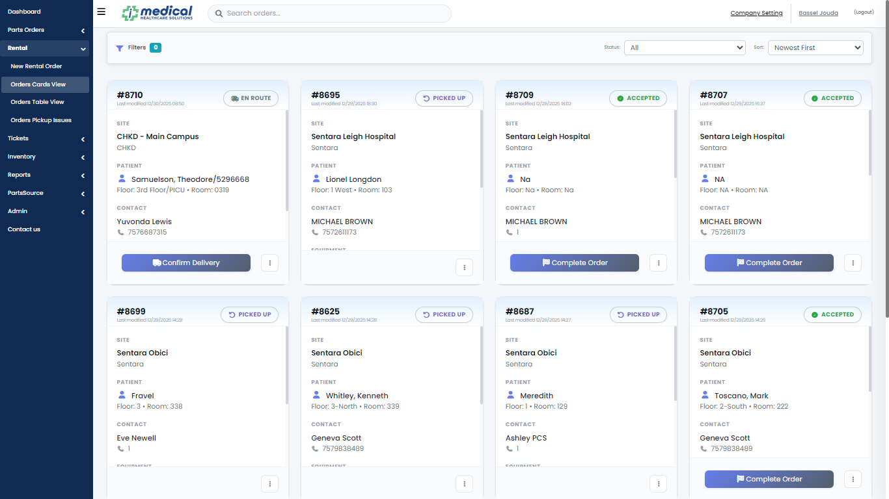
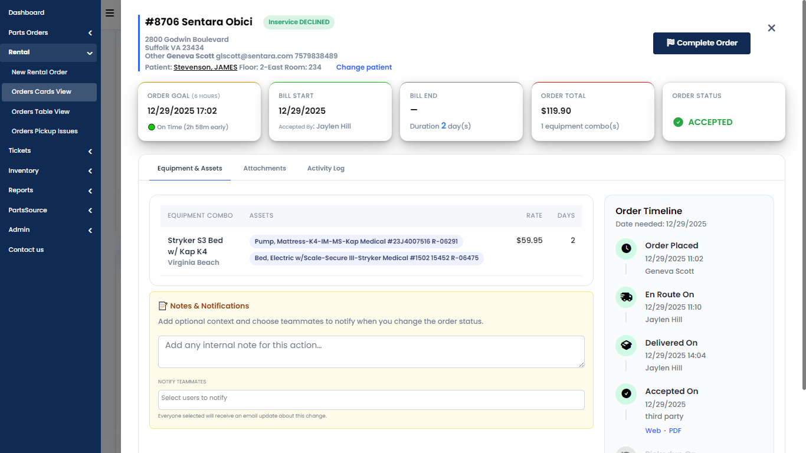
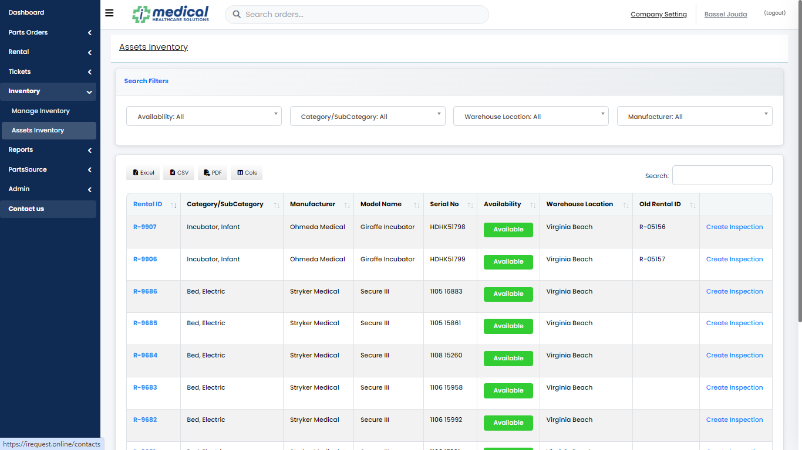
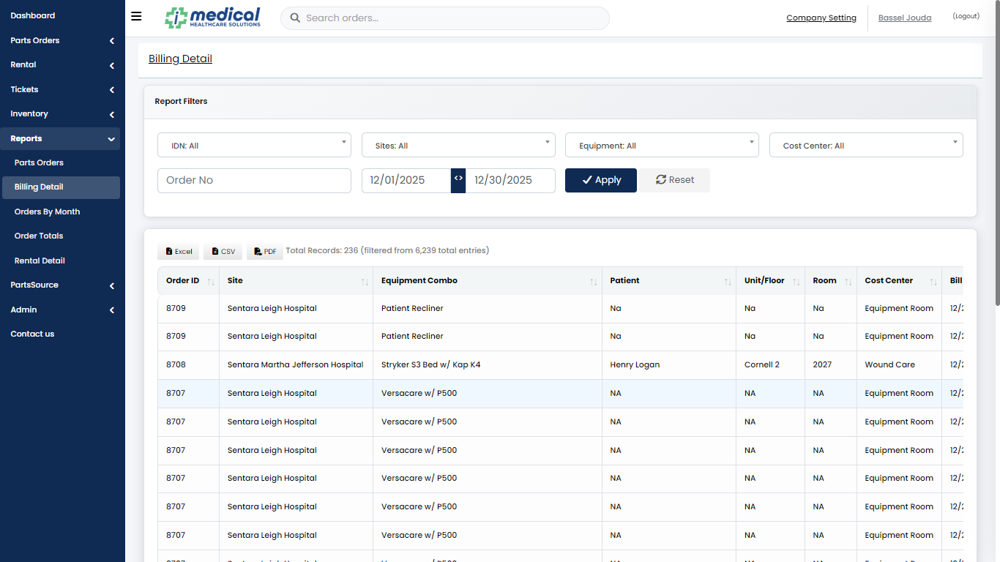
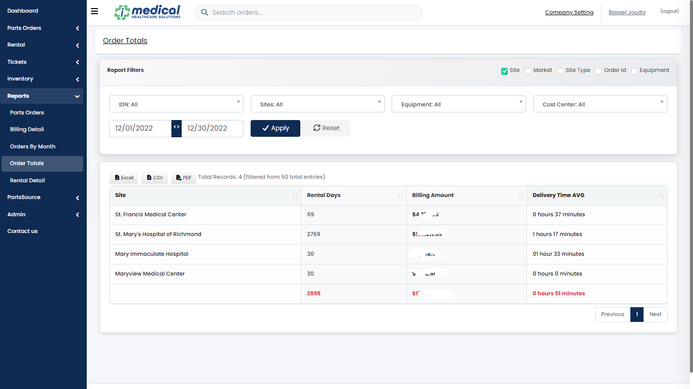
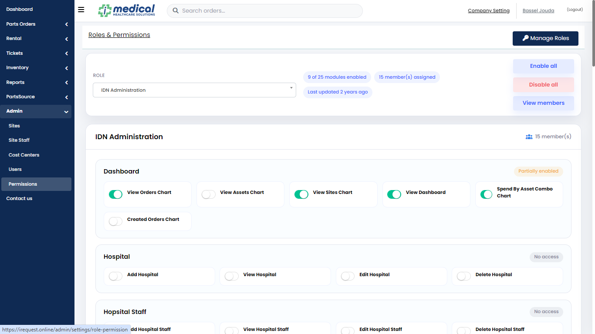

# iRequest - Medical Equipment Rental Management System

> **Demo Skeleton** | Portfolio Project | Laravel 8 Application

A comprehensive medical equipment rental management system designed for hospitals and healthcare facilities. This demo skeleton showcases the architecture, workflows, and technical implementation of a production-grade healthcare management platform.

---

## 📋 Table of Contents

- [Overview](#overview)
- [Screenshots](#screenshots)
- [Core Workflows](#core-workflows)
- [Architecture](#architecture)
- [Technology Stack](#technology-stack)
- [DevOps Strategy](#devops-strategy)
- [Project Status](#project-status)
- [Getting Started](#getting-started)
- [Testing](#testing)
- [Project Structure](#project-structure)

---

## 🎯 Overview

iRequest is a full-featured medical equipment rental management system that streamlines the complete lifecycle of equipment rentals, parts requests, and asset tracking for healthcare organizations. The system manages orders from creation through delivery, acceptance, billing, and pickup, while providing comprehensive reporting and analytics.

### Key Capabilities

- **Order Rental Management**: Complete order lifecycle management with status tracking
- **Parts Request System**: RFQ workflow, order processing, and RMA (Return Merchandise Authorization) management
- **Asset Tracking**: Integration with CMMS inventory systems for real-time asset availability
- **Analytics & Reporting**: Comprehensive dashboards with KPIs, revenue analytics, and forecasting
- **Multi-tenant Architecture**: Support for hospitals, IDNs (Integrated Delivery Networks), and cost centers
- **Role-based Access Control**: Granular permissions for different user roles (admin, staff, managers)

---

## 📸 Screenshots

### Authentication & Dashboard

*User authentication interface*


*Main dashboard with KPIs and analytics*


*Detailed analytics and reporting dashboard*

### Order Management

*Orders management interface with DataTables*


*Individual order details and status tracking*

### Inventory & Reports

*Inventory and asset tracking system*


*Comprehensive reporting interface*


*Advanced reporting with filtering options*

### Administration

*Role-based access control management*

---

## 🔄 Core Workflows

### 1. Order Rental Order Workflow

```
Order Creation → Pending → In Route → Delivered → Accepted → Completed → Picked Up
                                                      ↓
                                                 Reassigned
```

**Key Stages:**
- **Pending**: Order created, awaiting processing
- **In Route**: Equipment dispatched to hospital
- **Delivered**: Equipment delivered to location
- **Accepted**: Hospital accepts equipment (signature capture)
- **Completed**: Billing period ends, rental calculations finalized
- **Picked Up**: Equipment retrieved from hospital
- **Reassigned**: Equipment transferred to new location/patient

**Features:**
- Real-time status transitions with audit logging
- Automatic rental day calculations based on billing periods
- Asset assignment and tracking through CMMS integration
- Pickup request management with issue tracking
- Order reassignment for equipment transfers
- PDF generation for order forms and acceptance notes

### 2. Parts Request & Order Workflow

```
Parts Request → RFQ Requested → RFQ Replied → Order Created → Fulfill → Processing → Shipped → Completed
                                                                              ↓
                                                                         RMA Request
```

**Key Stages:**
- **Request**: Hospital requests medical parts
- **RFQ Workflow**: Request for Quote with pricing and alternative part suggestions
- **Order Creation**: Convert approved requests to orders with PO management
- **Fulfillment**: Inventory allocation and quantity management
- **Processing**: Packing slip generation and shipping preparation
- **Shipping**: Shippo integration for label generation and tracking
- **RMA Management**: Return authorization for defective/returned parts

**Features:**
- Alternative part suggestions and price negotiation
- Partial order fulfillment handling
- Shipping integration with address validation
- RMA approval/rejection workflow
- Customer resolution for inspection disputes

### 3. Dashboard & Analytics Workflow

```
Data Aggregation → KPI Calculation → Chart Generation → AI Forecasting → Alert Generation
```

**Key Components:**
- **Real-time KPIs**: Active rentals, total assets, monthly revenue, delivery/pickup times
- **Revenue Analytics**: Monthly trends, hospital comparisons, asset spend tracking
- **Order Analytics**: Status distributions, delivery performance, reassignment tracking
- **AI Forecasting**: Machine learning predictions for revenue and trends
- **Alert System**: Pending orders, performance issues, system status

---

## 🏗️ Architecture

### System Architecture

```
┌─────────────────────────────────────────────────────────────┐
│                     Client Layer                            │
│  (Web Browser / Mobile Devices)                            │
└──────────────────────┬──────────────────────────────────────┘
                       │
┌──────────────────────▼──────────────────────────────────────┐
│                  Application Layer                           │
│  ┌──────────────┐  ┌──────────────┐  ┌──────────────┐     │
│  │   Nginx      │  │   Laravel    │  │   PHP-FPM    │     │
│  │  (Web Server)│  │  Framework   │  │  (Runtime)   │     │
│  └──────────────┘  └──────────────┘  └──────────────┘     │
└──────────────────────┬──────────────────────────────────────┘
                       │
┌──────────────────────▼──────────────────────────────────────┐
│                  Business Logic Layer                        │
│  ┌──────────────┐  ┌──────────────┐  ┌──────────────┐     │
│  │ Controllers  │  │   Services   │  │    Jobs      │     │
│  │  (HTTP)      │  │ (Interfaces) │  │  (Queues)    │     │
│  └──────────────┘  └──────────────┘  └──────────────┘     │
│  ┌──────────────┐  ┌──────────────┐  ┌──────────────┐     │
│  │   Models     │  │ Notifications│  │  Commands    │     │
│  │ (Eloquent)   │  │  (Email/SMS) │  │  (Console)    │     │
│  └──────────────┘  └──────────────┘  └──────────────┘     │
└──────────────────────┬──────────────────────────────────────┘
                       │
┌──────────────────────▼──────────────────────────────────────┐
│                    Data Layer                                 │
│  ┌──────────────┐  ┌──────────────┐  ┌──────────────┐     │
│  │    MySQL     │  │    Redis     │  │   Storage    │     │
│  │  (Database)  │  │  (Cache/Session)│  (Files)     │     │
│  └──────────────┘  └──────────────┘  └──────────────┘     │
└─────────────────────────────────────────────────────────────┘
```

### Application Architecture

#### **MVC Pattern with Service Layer**

- **Models**: Eloquent ORM models with relationships (Orders, Users, Hospitals, etc.)
- **Views**: Blade templates with DataTables integration
- **Controllers**: HTTP request handling with permission checks
- **Services**: Interface-based service layer (ShippoService, RestApiWrapper, etc.)
- **Jobs**: Background processing for async tasks
- **Notifications**: Multi-channel notifications (Email, SMS, Database)

#### **Key Design Patterns**

- **Repository Pattern**: Service interfaces abstracting data access
- **Observer Pattern**: Model events for status transitions
- **Factory Pattern**: Model factories for testing
- **Strategy Pattern**: Different notification channels
- **Middleware Pattern**: Authentication, authorization, and request filtering

#### **Database Architecture**

- **Primary Database**: MySQL 8.0 with InnoDB engine
- **Caching**: Redis for sessions, cache, and queue management
- **Relationships**: Complex many-to-many and polymorphic relationships
- **Indexing**: Optimized indexes for performance-critical queries
- **Soft Deletes**: Soft deletion for audit trails

#### **Security Architecture**

- **Authentication**: Laravel's built-in authentication with Entrust RBAC
- **Authorization**: Role-based permissions with granular access control
- **Data Scoping**: Hospital/IDN-based data isolation
- **Input Validation**: Request validation and sanitization
- **CSRF Protection**: Token-based CSRF protection
- **XSS Protection**: Blade template escaping

---

## 🛠️ Technology Stack

### Backend
- **Framework**: Laravel 8.x
- **PHP**: 7.4+
- **Database**: MySQL 8.0
- **Cache/Session**: Redis
- **Queue**: Redis-based queue system

### Frontend
- **Templates**: Blade templating engine
- **JavaScript**: jQuery, DataTables
- **CSS**: Bootstrap, custom styles
- **Charts**: Chart.js integration

### Third-Party Integrations
- **Shipping**: Shippo API (address validation, label generation, tracking)
- **Parts Catalog**: PartsSource, Hillrom integration
- **Notifications**: Nexmo (SMS), Mail (Email)
- **PDF Generation**: DomPDF
- **Excel Processing**: Maatwebsite Excel

### Development Tools
- **Testing**: PHPUnit
- **Code Quality**: PHP CS Fixer (recommended)
- **Version Control**: Git
- **Containerization**: Docker & Docker Compose

---

## 🚀 DevOps Strategy

### Dockerized Local Environment

The project includes a complete Docker setup for local development:

**Services:**
- **app**: PHP 7.4-FPM application container
- **nginx**: Nginx web server (port 8080)
- **db**: MySQL 8.0 database (port 3306)
- **redis**: Redis cache/session store (port 6379)
- **phpmyadmin**: Database management UI (port 8081)

**Quick Start:**
```bash
# Automated setup
chmod +x docker-setup.sh
./docker-setup.sh

# Or manual setup
docker-compose up -d --build
docker-compose exec app composer install
docker-compose exec app php artisan key:generate
docker-compose exec app php artisan migrate
```

**Benefits:**
- Consistent development environment across team members
- Isolated services with proper networking
- Easy database and cache management
- Simplified onboarding for new developers

See [DOCKER_SETUP.md](DOCKER_SETUP.md) for detailed Docker documentation.

### CI Pipeline for Automated Validation

**Recommended CI/CD Pipeline:**

1. **Code Quality Checks**
   - PHP syntax validation
   - Code style checks (PSR-12)
   - Static analysis (PHPStan/Psalm)

2. **Testing**
   - Unit tests (PHPUnit)
   - Integration tests
   - Test coverage reports

3. **Security Scanning**
   - Dependency vulnerability scanning
   - Code security analysis

4. **Build & Deploy**
   - Docker image building
   - Environment-specific deployments

**Example CI Configuration (GitHub Actions / GitLab CI):**
```yaml
# .github/workflows/ci.yml (example)
name: CI Pipeline
on: [push, pull_request]
jobs:
  test:
    runs-on: ubuntu-latest
    steps:
      - uses: actions/checkout@v2
      - name: Setup PHP
        uses: shivammathur/setup-php@v2
        with:
          php-version: '7.4'
      - name: Install Dependencies
        run: composer install
      - name: Run Tests
        run: php artisan test
```

### Production Codebase Privacy

**Important:** The production codebase is **private** and not publicly available due to:
- **NDA Agreements**: Non-disclosure agreements with clients
- **Business Logic Protection**: Proprietary algorithms and workflows
- **Security Considerations**: Sensitive integration credentials and configurations
- **Client Confidentiality**: Healthcare data handling requirements

This demo skeleton has been created specifically for portfolio purposes with:
- All business logic removed
- Sensitive data replaced with dummy data
- External API integrations disabled
- Security-sensitive code removed
- Real workflows replaced with documentation

---

## 📊 Project Status

### Status: **Demo / Skeleton (Portfolio use only)**

This is a **converted demo skeleton** of a production application, specifically prepared for portfolio presentation.

### Conversion Status

✅ **Completed:**
- Services converted to interfaces
- Controllers return dummy data (Orders, Parts, Reports, Dashboard, etc.)
- Models maintain structure with relationships only
- Routes organized and cleaned
- Security-sensitive code removed
- External API integrations disabled
- Unit tests created (Users, Orders)
- Docker configuration complete

📝 **Documentation:**
- Comprehensive code comments explaining original functionality
- Architecture documentation
- Docker setup guides
- Testing documentation

### What's Included

- ✅ Complete folder structure
- ✅ Route definitions
- ✅ View templates (Blade)
- ✅ Model relationships
- ✅ Permission structure
- ✅ Controller skeletons with dummy data
- ✅ Service interfaces
- ✅ Docker configuration
- ✅ Unit tests

### What's Removed

- ❌ Business logic and calculations
- ❌ Database queries (replaced with dummy data)
- ❌ External API integrations
- ❌ Security-sensitive code
- ❌ Real workflows and processes
- ❌ Production configurations

---

## 🚀 Getting Started

### Prerequisites

- Docker Desktop (or Docker Engine + Docker Compose)
- Git
- 4GB+ available RAM

### Installation

1. **Clone the repository:**
   ```bash
   git clone <repository-url>
   cd irequest-demo
   ```

2. **Run Docker setup:**
   ```bash
   chmod +x docker-setup.sh
   ./docker-setup.sh
   ```

3. **Access the application:**
   - Application: http://localhost:8080
   - phpMyAdmin: http://localhost:8081

See [DOCKER_SETUP.md](DOCKER_SETUP.md) for detailed setup instructions.

### Manual Setup (without Docker)

1. **Install dependencies:**
   ```bash
   composer install
   npm install
   ```

2. **Configure environment:**
   ```bash
   cp .env.example .env
   php artisan key:generate
   ```

3. **Setup database:**
   ```bash
   php artisan migrate
   php artisan db:seed
   ```

4. **Start development server:**
   ```bash
   php artisan serve
   ```

---

## 🧪 Testing

### Running Tests

```bash
# Using Docker
docker-compose exec app php artisan test

# Or directly
php artisan test
```

### Test Coverage

- **Unit Tests**: Model relationships, accessors, basic functionality
- **Test Files**:
  - `tests/Unit/UserTest.php` - User model tests
  - `tests/Unit/OrdersTest.php` - Orders model tests

### Test Structure

Tests focus on:
- Model relationships validation
- Accessor/mutator functionality
- Basic CRUD operations
- Data casting and type validation

---

## 📁 Project Structure

```
irequest-demo/
├── app/
│   ├── Http/
│   │   └── Controllers/        # HTTP controllers (skeleton)
│   ├── Models/                  # Eloquent models (relationships only)
│   ├── Services/                # Service interfaces
│   ├── Jobs/                    # Queue jobs (skeleton)
│   ├── Notifications/           # Notification classes (skeleton)
│   └── Helper/                  # Helper functions
├── config/                      # Configuration files
├── database/
│   ├── migrations/              # Database migrations
│   └── seeders/                 # Database seeders
├── docker/                      # Docker configuration files
├── public/                       # Public assets
├── resources/
│   ├── views/                   # Blade templates
│   └── lang/                    # Language files
├── routes/                       # Route definitions
├── tests/                        # PHPUnit tests
├── Dockerfile                    # PHP-FPM container
├── docker-compose.yml            # Docker services
└── README.md                     # This file
```

---

## 📚 Additional Documentation

- [DOCKER_SETUP.md](DOCKER_SETUP.md) - Docker setup and usage guide
- [docker/README.md](docker/README.md) - Docker-specific documentation
- [README_DEMO_CONVERSION.md](README_DEMO_CONVERSION.md) - Conversion patterns and notes
- [CONVERSION_SUMMARY.md](CONVERSION_SUMMARY.md) - Conversion summary

---

## 📝 License

This is a demo skeleton for portfolio purposes. The original production codebase is proprietary and subject to NDA agreements.

---

## 👤 Author

Basel Jouda

Portfolio project - Demo skeleton of a production medical equipment rental management system.

**Note**: This demo skeleton is for portfolio demonstration only. All business logic, sensitive data, and production configurations have been removed or replaced with dummy data.